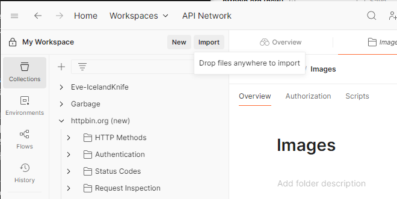

# REST API 개발 환경 구축
이 과제는 여러분들의 컴퓨터에 기초적인 REST API 개발 환경 구축을 위한 절차를 다룹니다. 다음 과정을 잘 따라하셔서, 프로젝트를 생성 후 개인 폴더에 업로드하여 PR 올려 주시기 바랍니다.

만일 설치 과정에서 오류가 발생하였을 경우, 스터디장에게 물어보시기 바랍니다!

## 설치할/설정할 유틸리티
- Git: 버전 관리
- Postman: API 테스트
- Docker Desktop: 컨테이너화 및 가상화를 통한 테스트환경/개발환경 단일화
- 각자의 프로젝트 세팅

## 공통 프로그램 설치
### Postman
Postman은 API 테스팅 플랫폼으로, Authorization, Cookie, Header, Body 등 다양한 부분을 커스터마이징/자동화 하여 테스트 편의성을 제공하는 유틸리티입니다.

REST API 뿐만 아니라, Websocket, gRPC 등 HTTP 기반의 차세대 API 규격까지 지원합니다.

#### 설치
[Postman 공식 웹사이트](https://www.postman.com/downloads/)로 이동하여, OS에 맞는 설치 프로그램을 다운로드 후 설치를 진행합니다.

프로그램이 설치 후 실행되었다면, (만일 계정이 존재하지 않을 경우) 메인 화면의 Create Account 버튼을 눌러 계정 생성 웹페이지로 이동 후 계정을 생성합니다.

이 때, 소셜 계정 등을 활용할 수도 있습니다(Github, Google)

이미 계정이 존재하신다면, 존재하는 계정으로 로그인 하셔도 괜찮습니다.

#### 사용 테스트
HTTPBin 프로젝트를 Import 해올 겁니다.

1. [HTTPBin Project JSON export](./tasks/httpbin.org%20(new).postman_collection.json)를 다운로드 받습니다.
2. Postman 프로그램 왼쪽 위, 워크스페이스명 오른쪽에 있는 Import 버튼을 클릭합니다.
    
3. 다운로드 받은 JSON 파일을 드래그-드랍 합니다.
4. `httpbin.org (new)` 컬렉션이 추가되면, 직접 이것저것 눌러보면서 테스트 해 봅시다!

## OS
각자의 OS에 맞춰 링크를 눌러 주시기 바랍니다!
- [MacOS](./tasks/macos/README.md)
- [Windows](./tasks/windows/README.md)