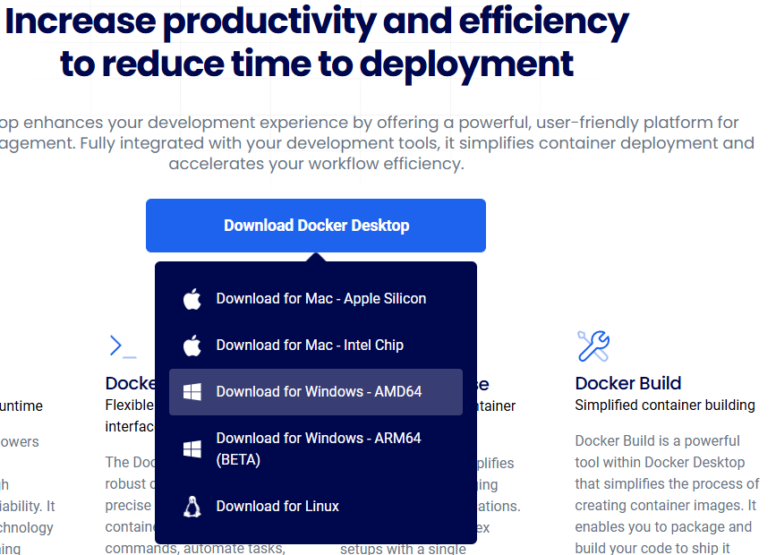

# REST API 개발 환경 구축(Windows)

## Git
**만일 Git이 설치되어 있지 않다면**, 아래 절차를 따라 Git을 설치합니다. 이미 설치되어 있다면, 아래 [설치 확인](#설치-확인)을 진행하여 설치가 진행되었는지 확인하고, 설치되어 있을 경우 이 단계를 건너뛰셔도 됩니다.

#### 방법 1: 직접 설치 프로그램 사용

1. Git 공식 웹사이트에서 Windows용 설치 프로그램을 다운로드합니다.
1. 다운로드한 .exe 파일을 실행합니다.
1. 설치 과정에서 다음 옵션들을 주의해서 선택합니다:

    - "Adjusting your PATH environment": "Git from the command line and also from 3rd-party software" 선택 (권장)
    - "Choosing HTTPS transport backend": "Use the OpenSSL library" 선택 (권장)
    - "Configuring the line ending conversions": "Checkout Windows-style, commit Unix-style line endings" 선택 (권장)
    - "Configuring the terminal emulator": "Use Windows' default console window" 또는 "Use MinTTY" 중 선택
    - "Default behavior of 'git pull'": "Default" 선택
    - 나머지 옵션은 기본값 유지

#### 방법 2: Chocolatey 사용

1. PowerShell을 관리자 권한으로 실행합니다.
1. Chocolatey가 설치되어 있지 않다면, 다음 명령어로 설치합니다:
    ```powershell
    Set-ExecutionPolicy Bypass -Scope Process -Force; [System.Net.ServicePointManager]::SecurityProtocol = [System.Net.ServicePointManager]::SecurityProtocol -bor 3072; iex ((New-Object System.Net.WebClient).DownloadString('https://community.chocolatey.org/install.ps1'))
    ```

1. Git을 설치합니다:
    ```powershell
    choco install git -y
    ```

### 설치 확인
명령 프롬프트(CMD) 또는 PowerShell에서 다음 명령어를 실행하여 Git이 올바르게 설치되었는지 확인합니다:
```powershell
git --version
```
현재 Git 프로그램의 버전이 나온다면 성공입니다. 만약 git 명령어를 찾지 못한다고 나올 경우, 재설치를 진행하여야 합니다.

### 개인 정보 설정
설치 완료 후, Commit 메시지 등에 추가될 개인 정보를 설정합니다. 이메일은 **"반드시"** Github에서 사용하는 이메일이어야 합니다!
```bash
git config --global user.name "Your Name"
git config --global user.email "your.email@example.com"
```

## Docker Desktop
Windows에서의 Docker는 굉장히 까다롭고 어려운 설치를 자랑합니다. 아래 문서를 유의 깊게 살펴보고, 반드시 절차대로 진행해 주시기 바랍니다.

> Docker가 이미 설치되어 있다면 아래 진행을 건너뛰고 바로 설치 확인을 진행하셔도 괜찮습니다!

### 시스템 요구사항

- Windows 10 64-bit (Build 19041 이상) 또는 Windows 11
- WSL 2 (Windows Subsystem for Linux 2)
- 가상화 지원 활성화 (BIOS/UEFI 설정에서)
- 최소 4GB RAM


### WSL 2 설치 (필수)

1. PowerShell을 관리자 권한으로 실행합니다.
1. WSL 설치를 진행합니다.:
    ```powershell
    wsl --install
    ```

1. 컴퓨터를 재부팅합니다.

### Docker Desktop 설치

1. [Docker Desktop 공식 웹사이트](https://www.docker.com/products/docker-desktop)에서 Windows용 설치 파일을 다운로드합니다.
    웹사이트 중간에, Download Docker Desktop 버튼을 누르면 OS를 선택하는 다이얼로그가 출력됩니다.
    
1. 다운로드한 .exe 파일을 실행합니다.
1. 설치 지침을 따릅니다. "Use WSL 2 instead of Hyper-V" 옵션을 선택합니다.
1. 설치가 완료되면 Docker Desktop을 실행합니다.


만일 위 설치 과정에서 오류가 발생하였을 경우, 스터디장에게 물어보시기 바랍니다!